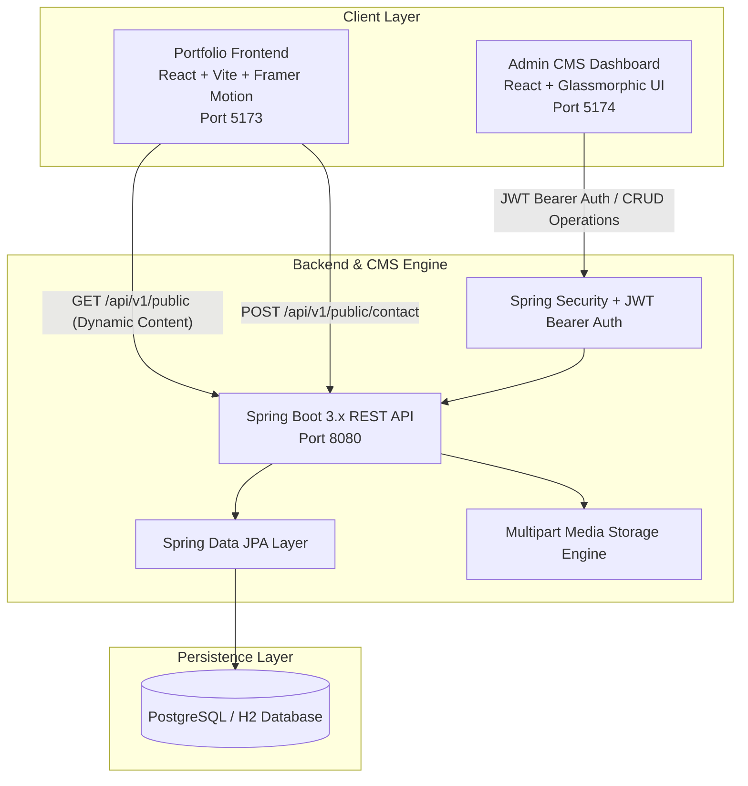

# 🚀 Piyush Funde — Full-Stack Portfolio & Custom CMS

[](https://reactjs.org/)
[](https://vitejs.dev/)
[](https://spring.io/projects/spring-boot)
[](https://www.oracle.com/java/)
[](https://jwt.io/)
[](https://opensource.org/licenses/MIT)

A modern, high-performance personal portfolio connected to a **custom-built Java Spring Boot 3.x Headless CMS** and an **interactive Admin Control Dashboard**.

🌐 **Live Website:** [https://piyushfunde-portfolio.vercel.app/](https://piyushfunde-portfolio.vercel.app/)

---

## 🏗️ System Architecture

This project is engineered with a **fully decoupled full-stack architecture**:



---

## ✨ Key Features & Upgrades

### 🎨 1. Dynamic Portfolio Frontend
- **Decoupled API Integration**: Dynamically loads projects, skills, timeline, certifications, and blogs via `src/api.js` with zero-downtime offline fallback.
- **Modern Dark Aesthetics**: 28px dot-grid texture, ambient drifting mesh gradient blobs, and glassmorphic cards with subtle inset highlights.
- **Smooth Micro-Interactions**: Framer Motion entrance animations, floating social badges, and interactive project showcases.
- **Dual-Channel Contact System**: Contact form submissions are dispatched via **EmailJS** and persistently logged into the CMS database.

### ☕ 2. Custom Spring Boot 3.x CMS Backend
- **100% Custom-Coded Headless CMS**: Built from scratch without third-party CMS platforms (Strapi, Sanity, Contentful), providing full schema control and native data ownership.
- **Spring Security & Rate Limiting**: Stateless token authentication (`HMAC-SHA256`) with brute-force rate limiting and 15-minute lockout protection on auth endpoints.
- **Relational Persistence**: PostgreSQL for production deployments (with connection pooling) and H2 in-memory mode for isolated unit testing.
- **Media Upload Service**: Native multipart file storage with Cloudinary/S3 integration support to prevent ephemeral disk loss.

### ⚡ 3. CMS Admin Control Center
- **Dedicated Dashboard**: Real-time content metrics, dynamic `/health` engine checks, and rapid publishing shortcuts.
- **Practical Admin Utilities**: Live inquiries inbox with read/unread flags, pending drafts manager, and visual CRUD tables.

---

## 🛠️ Technology Stack

| Tier | Technologies |
| :--- | :--- |
| **Portfolio Frontend** | React 18, Vite, Framer Motion, Lucide Icons, Vanilla CSS |
| **Admin CMS Panel** | React 18, Vite, Lucide React, Glassmorphic Theme |
| **Backend CMS** | Java 17, Spring Boot 3.2.5, Spring Data JPA, Spring Security |
| **Security** | JJWT (io.jsonwebtoken), BCrypt Password Hashing |
| **Database** | PostgreSQL / H2 Database Engine |
| **Email Service** | EmailJS & Spring Mail Notification Service |

---

## 📡 REST API Specifications

### Public Endpoints
- `GET /api/v1/public/about` — Fetch bio, profile details, and social links
- `GET /api/v1/public/projects` — List all projects (`?featured=true` for highlighted work)
- `GET /api/v1/public/skills` — Retrieve categorized skills with proficiency levels
- `GET /api/v1/public/experience` — Career and internship timeline
- `GET /api/v1/public/certificates` — Professional badges and verified credentials
- `GET /api/v1/public/blogs` — Published engineering articles and dev notes
- `POST /api/v1/public/contact` — Submit contact form inquiry

### Admin CMS Endpoints (Protected by JWT)
- `POST /api/v1/auth/login` — Authenticate admin user
- `GET /api/v1/admin/stats` — Retrieve CMS dashboard analytics
- `POST / PUT / DELETE /api/v1/admin/projects` — Manage portfolio projects
- `POST / PUT / DELETE /api/v1/admin/skills` — Manage technical skill sets
- `POST /api/v1/admin/media/upload` — Upload multipart image files
- `GET /api/v1/admin/messages` — Inbox for contact submissions

---

## 🚀 Local Development Setup

### 1. Run the Portfolio Frontend
```bash
cd piyush-portfolio
npm install
npm run dev
```
Portfolio runs at: `http://localhost:5173/`

### 2. Run the Custom CMS Admin Panel
```bash
cd admin-cms-frontend
npm install
npm run dev
```
Admin Dashboard runs at: `http://localhost:5174/`  
*Default Dev Credentials:* `admin` / `admin123`

### 3. Run the Spring Boot CMS Backend
```bash
cd backend-cms
# Run with your favorite Java IDE or Maven
mvn spring-boot:run
```
Backend API runs at: `http://localhost:8080/api/v1`  
H2 Database Console: `http://localhost:8080/h2-console`

---

## 📬 Contact & Connect

- **Portfolio:** [piyushfunde-portfolio.vercel.app](https://piyushfunde-portfolio.vercel.app/)
- **Email:** [fundepiyush18@gmail.com](mailto:fundepiyush18@gmail.com)
- **LinkedIn:** [linkedin.com/in/piyush-funde-22411725a](https://www.linkedin.com/in/piyush-funde-22411725a/)
- **GitHub:** [github.com/piyushFunde](https://github.com/piyushFunde)

---

## 📄 License

This project is licensed under the **MIT License** — feel free to fork, customize, and build upon it!

> *"Crafting resilient distributed systems, intelligent workflows, and modern web experiences."*
